King County House Price
================
Yuhsiang Hong

## Introduction

It has been roughly one year when the pandemic put the housing market on
hold for several months last spring. But the real estate market bounced
back quickly and has been booming since then. More existing homes were
sold in 2020 than in any year since 2006. Therefore, the purpose of this
project is to build a regression model to understand the relationship
between the house price and some significant features of the house.

I believe that the project could be very useful. For people who plan to
buy a house, they can get the expected house price based on the features
of the house. For real estate companies, they can determine what the
house price is and raise their profits by understanding what kinds of
features affect the house price.

This course is mainly about Data Wrangling, so in this project, I will
focus on Data Processing and Data Exploratory. In these parts, I am
going implement some of the techniques and packages that has been
utilized in the assignments and during the lectures. However, there will
be model fitting at the end of the project so that we can have a deeper
insight of the relationship between the house price and other features.

## Overview of the Dataset

The dataset I use is from Kaggle. The data contains the houses that were
sold from May 2014 to May 2015. Total number of observations is over 20
thousand. There are total 21 different variables in the dataset. It
includes house prices of King County in Washington state, which will be
the dependent variable in the regression model. Other variables which
will be the predictors in the regression model are some features of the
house such as numbers of bathrooms, square footage of interior living
space, the year of the house initially built, and so on. (For more
details, go check
<https://www.kaggle.com/harlfoxem/housesalesprediction>)

## Data Preparation

Check if there is any the missing
    value.

    ##            id          date         price      bedrooms     bathrooms 
    ##             0             0             0             0             0 
    ##   sqft_living      sqft_lot        floors    waterfront          view 
    ##             0             0             0             0             0 
    ##     condition         grade    sqft_above sqft_basement      yr_built 
    ##             0             0             2             0             0 
    ##  yr_renovated       zipcode           lat          long sqft_living15 
    ##             0             0             0             0             0 
    ##    sqft_lot15 
    ##             0

Since there are only two observations that have missing values, I will
just remove both of them.

Implement linear regression model on the whole dataset to get the
overview of the further analysis.

    ## # A tibble: 1 x 11
    ##   r.squared adj.r.squared  sigma statistic p.value    df  logLik    AIC    BIC
    ##       <dbl>         <dbl>  <dbl>     <dbl>   <dbl> <int>   <dbl>  <dbl>  <dbl>
    ## 1     0.701         0.701 2.01e5     2666.       0    20 -2.95e5 5.89e5 5.89e5
    ## # … with 2 more variables: deviance <dbl>, df.residual <int>

The r.squared right now is 0.7011446.

## Data Cleaning

Before fitting the final model, I need to do some data cleaning and
organizing in order to make the model more meaningful and perform
better.

Since `id` is meaningless to house price, it will be removed. There are
several variables that should be converted to categorical types:

  - `waterfront` is a boolean, indicating if the house has a view to a
    waterfront.
  - `view` indicates how good the view of the property is. As it only
    has 4 values, this feature can be factorized.  
  - `condition` is a score from 1 to 5, indicating the state of the
    house.  
  - `grade` is another score, with 11 levels (3 ~ 13).
  - `zipcode` is a cluster-like category of the house location.
  - Since I intend to make the model more general, I will create a new
    variable, `age`, representing how many years the house had been
    built until it was sold. It is computed by the year of `date` minus
    `yr_built`. Moreover, `date` will be removed since I am more
    interested in the age of the house instead of the date it was sold.

<!-- end list -->

    ## # A tibble: 5 x 20
    ##    price bedrooms bathrooms sqft_living sqft_lot floors waterfront view 
    ##    <dbl>    <dbl>     <dbl>       <dbl>    <dbl>  <dbl> <fct>      <fct>
    ## 1 221900        3      1           1180     5650      1 0          0    
    ## 2 538000        3      2.25        2570     7242      2 0          0    
    ## 3 180000        2      1            770    10000      1 0          0    
    ## 4 604000        4      3           1960     5000      1 0          0    
    ## 5 510000        3      2           1680     8080      1 0          0    
    ## # … with 12 more variables: condition <fct>, grade <fct>, sqft_above <dbl>,
    ## #   sqft_basement <dbl>, yr_built <dbl>, yr_renovated <dbl>, zipcode <fct>,
    ## #   lat <dbl>, long <dbl>, sqft_living15 <dbl>, sqft_lot15 <dbl>, age <dbl>

## Data Exploratory

**1. Dependent Variable**

Our target is `price`, so let’s check its distribution. In Plot 1, the
house price is highly right-skewed, indicating that with log
transformation, its distribution can be more normal as we can see in
Plot 2.

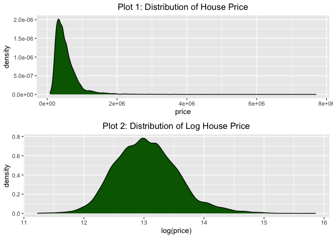<!-- -->

These expensive houses cannot be removed from the dataset, as they are
not anomalies but examples of the luxury market in the region. By
transforming the data with a logarithm to base 10, it is easy to
rebalance the dataset. This transformation could be used later to try to
improve our models’ performance.

**2. Categorical
Features**

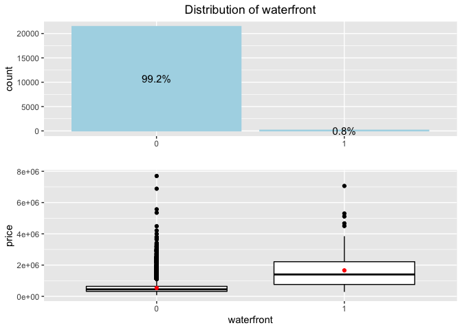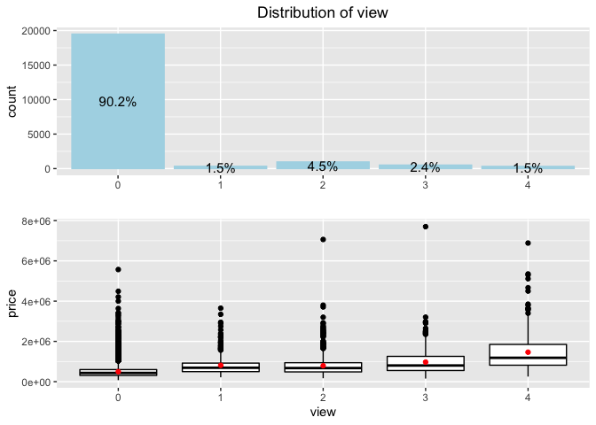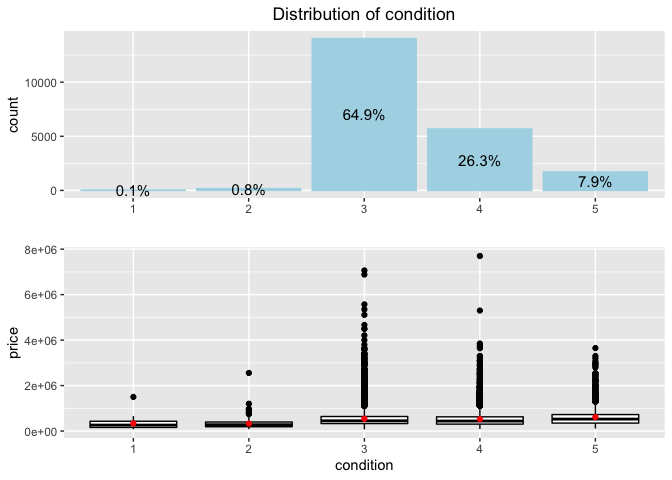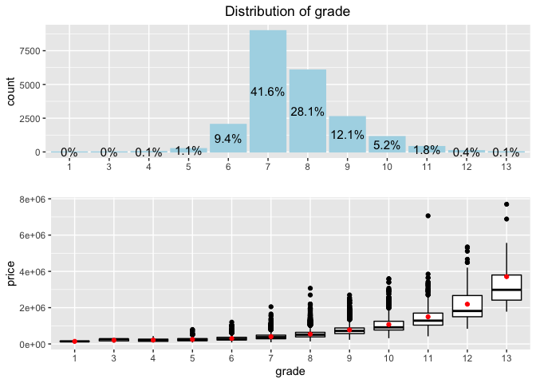
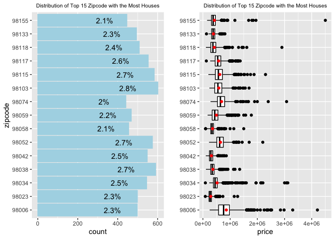<!-- -->

From the above plots, there are some interesting observations:

  - Majority of the houses don’t have `waterfront`. For houses with
    `waterfront`, they are normally more expensive than houses without
    `waterfront`.
  - Most of houses have really bad views, which is over 90%, but the
    house price increases when the score of house’ view increases, which
    makes sense.
  - Most of the houses in the region are in an average condition 3, with
    26% of the houses being in a great condition 4, and 8% being in an
    exceptional condition 5. The house price does increase as the
    condition becomes better. However, the change isn’t significant.
  - `grade` distribution is similar to `condition` distribution. Its
    relationship with `price` seems exponential, so if log
    transformation on `price` is used, we can expect their relationship
    would be linear.
  - From top 15 `zipcode` containing the most houses, we can see that
    there is no specific area which has the most houses. `price` is
    fluctuated among these 15 houses and for more information of their
    relationship such as which area might have higher house prices, it
    still need further investigation.

**3. Numerical Features**

<!-- -->

There are some interesting things in the correlation plot:

  - the sqft\_ features are highly correlated to each others, as
    `sqft_living` = `sqft_above` + `sqft_basement.` Therefore, I will
    examine the distribution of `sqft_basement` later to check how many
    houses actuallly have basements.
  - If the house is big, its neighbor houses are usually big, as we can
    discover this correlation from `sqft_living` and `sqft_living15` or
    `sqft_lot` and `sqft_lot15`.
  - `bathrooms` and `bedrooms` have high positive correlation with
    `sqft_living`, which is expected since more bedrooms and bathrooms
    in the house requires more space.

Let’s examine some of the numeric features that I didn’t get much
information from the above graph: `lat`, `long`, `yr_built`,
`yr_renovated`, `age`,
`floors`.

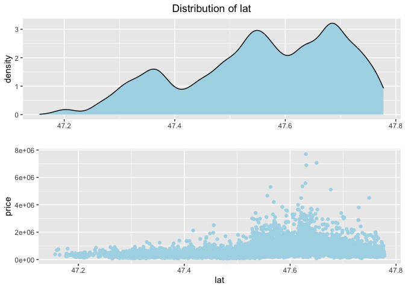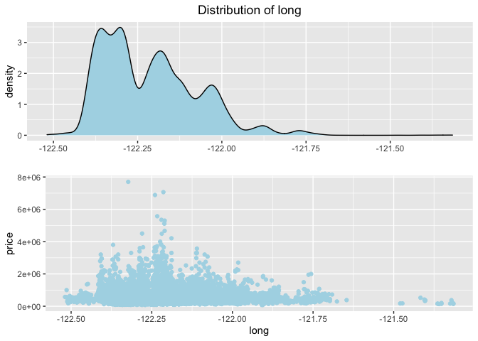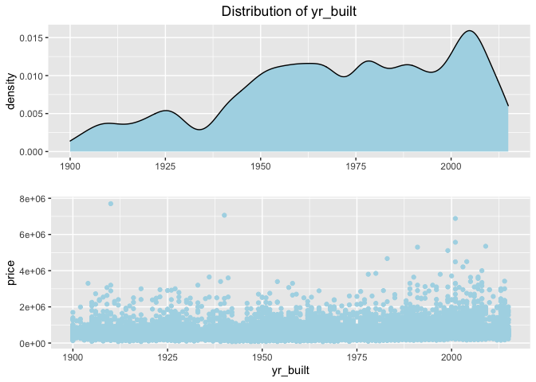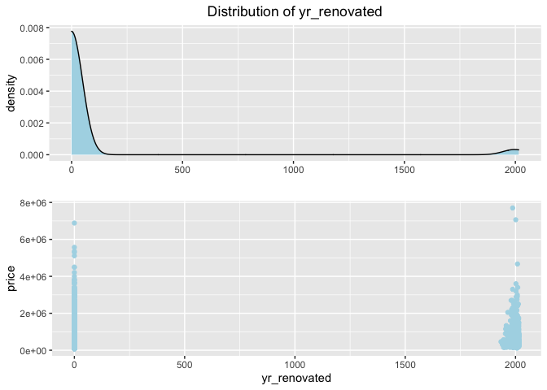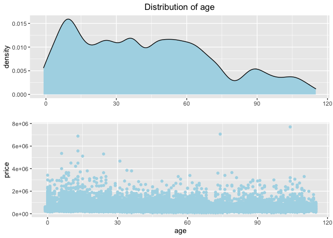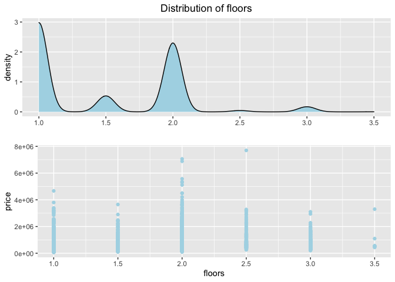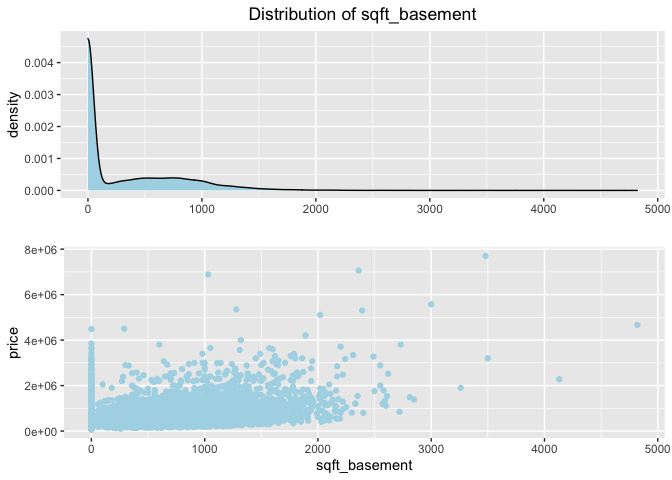

From the above plots,

  - `lat` and `long` distributions suggest a higher number of houses in
    the North-West of the region. I will use ggmap to show this
    phenomenon in the below map graph.
  - Looking at the distribution of the feature `yr_built`, we can
    observe a steady increase of the number of houses since the early
    years of the 20th century. This trend can certainly be related to
    the population growth and the urban development in the region over
    the years.
  - From `yr_renovated`, we can see that there are certain number of
    houses renovated during late 20th century to early 21st century
    However, most of the houses have never been renovated. Due to this
    reason, I will create a new boolean feature, `renovated`,
    representing whether the house has been renovated or not.
  - `age` and doesn’t show some significant relationship with `price`,
    which is interesting because I thought new houses might have higher
    prices.
  - Most of the houses have no more than two `floors`.
  - Since the percentage of houses without basements is 0.6073296,
    meaning majority of houses don’t have basements, I will create a new
    variable, `basement`, indicating whether the house has a basement or
    not. Moreover, `sqft_basement` will be removed since it’s a linear
    combination of `sqft_living` and `sqft_above`.

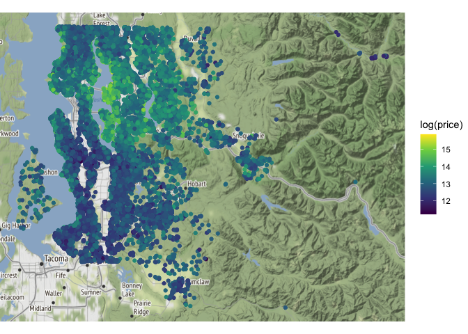<!-- -->

As we can see from the above map, northwest area has the lighter color,
indicating that this area in general has higher house prices.

All the remaining and new features in the tidy dataset: bedrooms,
bathrooms, sqft\_living, sqft\_lot, floors, waterfront, view, condition,
grade, sqft\_above, yr\_built, yr\_renovated, zipcode, lat, long,
sqft\_living15, sqft\_lot15, age, renovated, basement.

## Model Fitting

**1. Final model: dependent variable = `price`**

    ## # A tibble: 1 x 11
    ##   r.squared adj.r.squared  sigma statistic p.value    df  logLik    AIC    BIC
    ##       <dbl>         <dbl>  <dbl>     <dbl>   <dbl> <int>   <dbl>  <dbl>  <dbl>
    ## 1     0.838         0.837 1.48e5     1070.       0   105 -2.88e5 5.76e5 5.77e5
    ## # … with 2 more variables: deviance <dbl>, df.residual <int>

As we can see from the above, the final model has a higher r.squared
value than the raw model. The improvemnt rate on r.squared is
19.5277685%.

**2. Final log model: dependent variable = `log(price)`**

    ## # A tibble: 1 x 11
    ##   r.squared adj.r.squared sigma statistic p.value    df logLik     AIC     BIC
    ##       <dbl>         <dbl> <dbl>     <dbl>   <dbl> <int>  <dbl>   <dbl>   <dbl>
    ## 1     0.883         0.882 0.181     1558.       0   105  6358. -12503. -11658.
    ## # … with 2 more variables: deviance <dbl>, df.residual <int>

As we can see from the above, the final log model has a higher r.squared
value than the raw model. The improvemnt rate on r.squared is
25.9101154%. Moreover, it also outperforms the final model, indicating
that using `log(price)` as the target is more suitable for linear
regression model.

## Stepwise Model Selection

Since there are too many variables in the dataset, I will use stepwise
model selection to find out if there is smaller model that can also
predict the house price well enough. (BIC is used for model selection.)

**1. Forward stepwise model selection**

    ## # A tibble: 1 x 11
    ##   r.squared adj.r.squared sigma statistic p.value    df logLik     AIC     BIC
    ##       <dbl>         <dbl> <dbl>     <dbl>   <dbl> <int>  <dbl>   <dbl>   <dbl>
    ## 1     0.883         0.882 0.181     1588.       0   103  6356. -12505. -11675.
    ## # … with 2 more variables: deviance <dbl>, df.residual <int>

Features that are removed from the forward stepwise model: bedrooms,
sqft\_lot15.

**2. Backward stepwise model selection**

    ## # A tibble: 1 x 11
    ##   r.squared adj.r.squared sigma statistic p.value    df logLik     AIC     BIC
    ##       <dbl>         <dbl> <dbl>     <dbl>   <dbl> <int>  <dbl>   <dbl>   <dbl>
    ## 1     0.883         0.882 0.181     1588.       0   103  6356. -12505. -11675.
    ## # … with 2 more variables: deviance <dbl>, df.residual <int>

Features that are removed from the backward stepwise model: bedrooms,
sqft\_lot15.

Some observations from model selections:

  - After removing bedrooms, sqft\_lot15 from the model, both new
    stepwise models still maintain the same r squared as the final log
    model.
  - Both model remove bedrooms, sqft\_lot15, indicating that these
    features are less important than others.

## Conclusion & Improvement

1.  The regression model improves a lot when some features are converted
    into categorical types.
2.  In real world data, some variables such as prices often needs to be
    scaled in order to fit the model better.
3.  By adding new variables, the model can be more meaningful even
    though the performance doesn’t show some significant improvement.
4.  Proper Data Wrangling techniques can definitely help the model to
    obtain greater results.
5.  Variables like `zipcode` could be implemented some clustering
    algorithms to obtain more meaningful information of their
    distributions and relationships with the house price.
