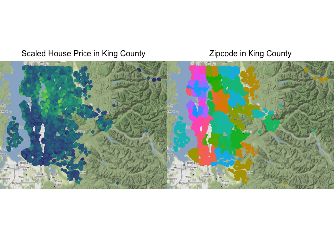
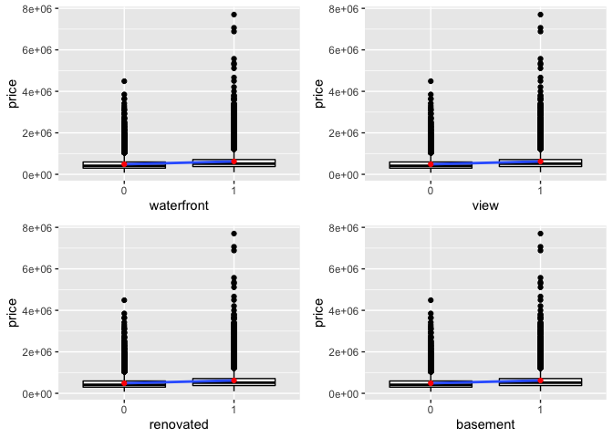
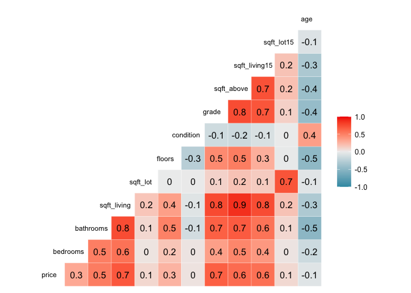

Test
================

## Objective

The purpose of this project is to build a regression model that can
predict the house price based on some features of the
    house.

``` r
library(tidyverse)
```

    ## ── Attaching packages ───────────────────────────────────────────────────────────────────── tidyverse 1.3.0 ──

    ## ✓ ggplot2 3.3.0     ✓ purrr   0.3.3
    ## ✓ tibble  3.0.0     ✓ dplyr   1.0.4
    ## ✓ tidyr   1.0.2     ✓ stringr 1.4.0
    ## ✓ readr   1.3.1     ✓ forcats 0.5.0

    ## ── Conflicts ──────────────────────────────────────────────────────────────────────── tidyverse_conflicts() ──
    ## x dplyr::filter() masks stats::filter()
    ## x dplyr::lag()    masks stats::lag()

``` r
library(ggmap)
```

    ## Google's Terms of Service: https://cloud.google.com/maps-platform/terms/.

    ## Please cite ggmap if you use it! See citation("ggmap") for details.

``` r
library(gridExtra)
```

    ## 
    ## Attaching package: 'gridExtra'

    ## The following object is masked from 'package:dplyr':
    ## 
    ##     combine

``` r
library(corrplot)
```

    ## corrplot 0.84 loaded

``` r
library(GGally)
```

    ## Registered S3 method overwritten by 'GGally':
    ##   method from   
    ##   +.gg   ggplot2

## Data Cleaning

``` r
# Import the data
kc_house <- read_csv("kc_house_data.csv")
```

    ## Parsed with column specification:
    ## cols(
    ##   .default = col_double(),
    ##   date = col_datetime(format = "")
    ## )

    ## See spec(...) for full column specifications.

``` r
head(kc_house)
```

    ## # A tibble: 6 x 21
    ##       id date                 price bedrooms bathrooms sqft_living sqft_lot
    ##    <dbl> <dttm>               <dbl>    <dbl>     <dbl>       <dbl>    <dbl>
    ## 1 7.13e9 2014-10-13 00:00:00 2.22e5        3      1           1180     5650
    ## 2 6.41e9 2014-12-09 00:00:00 5.38e5        3      2.25        2570     7242
    ## 3 5.63e9 2015-02-25 00:00:00 1.80e5        2      1            770    10000
    ## 4 2.49e9 2014-12-09 00:00:00 6.04e5        4      3           1960     5000
    ## 5 1.95e9 2015-02-18 00:00:00 5.10e5        3      2           1680     8080
    ## 6 7.24e9 2014-05-12 00:00:00 1.23e6        4      4.5         5420   101930
    ## # … with 14 more variables: floors <dbl>, waterfront <dbl>, view <dbl>,
    ## #   condition <dbl>, grade <dbl>, sqft_above <dbl>, sqft_basement <dbl>,
    ## #   yr_built <dbl>, yr_renovated <dbl>, zipcode <dbl>, lat <dbl>, long <dbl>,
    ## #   sqft_living15 <dbl>, sqft_lot15 <dbl>

``` r
summary(kc_house)
```

    ##        id                 date                         price        
    ##  Min.   :1.000e+06   Min.   :2014-05-02 00:00:00   Min.   :  75000  
    ##  1st Qu.:2.123e+09   1st Qu.:2014-07-22 00:00:00   1st Qu.: 321950  
    ##  Median :3.905e+09   Median :2014-10-16 00:00:00   Median : 450000  
    ##  Mean   :4.580e+09   Mean   :2014-10-29 04:38:01   Mean   : 540088  
    ##  3rd Qu.:7.309e+09   3rd Qu.:2015-02-17 00:00:00   3rd Qu.: 645000  
    ##  Max.   :9.900e+09   Max.   :2015-05-27 00:00:00   Max.   :7700000  
    ##                                                                     
    ##     bedrooms        bathrooms      sqft_living       sqft_lot      
    ##  Min.   : 0.000   Min.   :0.000   Min.   :  290   Min.   :    520  
    ##  1st Qu.: 3.000   1st Qu.:1.750   1st Qu.: 1427   1st Qu.:   5040  
    ##  Median : 3.000   Median :2.250   Median : 1910   Median :   7618  
    ##  Mean   : 3.371   Mean   :2.115   Mean   : 2080   Mean   :  15107  
    ##  3rd Qu.: 4.000   3rd Qu.:2.500   3rd Qu.: 2550   3rd Qu.:  10688  
    ##  Max.   :33.000   Max.   :8.000   Max.   :13540   Max.   :1651359  
    ##                                                                    
    ##      floors        waterfront            view          condition    
    ##  Min.   :1.000   Min.   :0.000000   Min.   :0.0000   Min.   :1.000  
    ##  1st Qu.:1.000   1st Qu.:0.000000   1st Qu.:0.0000   1st Qu.:3.000  
    ##  Median :1.500   Median :0.000000   Median :0.0000   Median :3.000  
    ##  Mean   :1.494   Mean   :0.007542   Mean   :0.2343   Mean   :3.409  
    ##  3rd Qu.:2.000   3rd Qu.:0.000000   3rd Qu.:0.0000   3rd Qu.:4.000  
    ##  Max.   :3.500   Max.   :1.000000   Max.   :4.0000   Max.   :5.000  
    ##                                                                     
    ##      grade          sqft_above   sqft_basement       yr_built   
    ##  Min.   : 1.000   Min.   : 290   Min.   :   0.0   Min.   :1900  
    ##  1st Qu.: 7.000   1st Qu.:1190   1st Qu.:   0.0   1st Qu.:1951  
    ##  Median : 7.000   Median :1560   Median :   0.0   Median :1975  
    ##  Mean   : 7.657   Mean   :1788   Mean   : 291.5   Mean   :1971  
    ##  3rd Qu.: 8.000   3rd Qu.:2210   3rd Qu.: 560.0   3rd Qu.:1997  
    ##  Max.   :13.000   Max.   :9410   Max.   :4820.0   Max.   :2015  
    ##                   NA's   :2                                     
    ##   yr_renovated       zipcode           lat             long       
    ##  Min.   :   0.0   Min.   :98001   Min.   :47.16   Min.   :-122.5  
    ##  1st Qu.:   0.0   1st Qu.:98033   1st Qu.:47.47   1st Qu.:-122.3  
    ##  Median :   0.0   Median :98065   Median :47.57   Median :-122.2  
    ##  Mean   :  84.4   Mean   :98078   Mean   :47.56   Mean   :-122.2  
    ##  3rd Qu.:   0.0   3rd Qu.:98118   3rd Qu.:47.68   3rd Qu.:-122.1  
    ##  Max.   :2015.0   Max.   :98199   Max.   :47.78   Max.   :-121.3  
    ##                                                                   
    ##  sqft_living15    sqft_lot15    
    ##  Min.   : 399   Min.   :   651  
    ##  1st Qu.:1490   1st Qu.:  5100  
    ##  Median :1840   Median :  7620  
    ##  Mean   :1987   Mean   : 12768  
    ##  3rd Qu.:2360   3rd Qu.: 10083  
    ##  Max.   :6210   Max.   :871200  
    ## 

Since “id” is meaningless to house price, it will be removed. There are
several variables that can be modified or merged to more meaningful new
variables:

1.  “age” will be computed by “date” minus “yr\_built” to represent how
    many years that the house had been built until the year it was sold.

2.  There are a lot of houses that have never been renovated, so
    “yr\_renovated” will be converted to a binary variable,
    “renovated”, showing whether this house had been renovated
    before it was sold.

3.  There are a lot of houses without basement as we can see from the
    summary. Thus, I will modify the “sqft\_basement” to a binary
    variable, “basement”, indicating if the house has the basement.

4.  Since all the data are from a county, the changes of longtitude and
    lattitude are very small. Moreover, the dataset contains zipcode,
    which is sufficient to reflect the relationship between the house
    price and the location. Therefore, I will remove these two
    variables.

For zipcode, waterfront and view, I will change them into factorial
variables.

``` r
kc_house <- kc_house %>% 
  mutate(age = as.numeric(format(date, format="%Y")) - yr_built) %>% 
  mutate(renovated = as.factor(as.numeric(yr_renovated != 0))) %>% 
  mutate(basement = as.factor(as.numeric(sqft_basement != 0))) %>% 
  mutate(zipcode = as.factor(zipcode)) %>% 
  mutate(waterfront = as.factor(waterfront)) %>% 
  mutate(view = as.factor(view)) %>% 
  select(-id, -date, -sqft_basement, -yr_built, -yr_renovated)
```

Handle missing
    values.

``` r
sapply(kc_house, function(x) sum(is.na(x)))
```

    ##         price      bedrooms     bathrooms   sqft_living      sqft_lot 
    ##             0             0             0             0             0 
    ##        floors    waterfront          view     condition         grade 
    ##             0             0             0             0             0 
    ##    sqft_above       zipcode           lat          long sqft_living15 
    ##             2             0             0             0             0 
    ##    sqft_lot15           age     renovated      basement 
    ##             0             0             0             0

Since there are only two missing values, I will remove these two
observations with missing values.

``` r
kc_house <- na.omit(kc_house)
```

Handle variables with regard to the location of the house: lat, long,
zipcode.

Visualize the house price across different regions in the county.

``` r
# 
p1 <- qmplot(long, lat, maptype = "watercolor", color = log(price), data = kc_house, 
       main = "Scaled House Price in King County") + 
  theme(plot.title = element_text(size = 12)) + 
  theme(plot.title = element_text(hjust = 0.5)) + 
  guides(color = FALSE) +
  scale_colour_viridis_c()
```

    ## Using zoom = 10...

    ## Source : http://tile.stamen.com/terrain/10/163/356.png

    ## Source : http://tile.stamen.com/terrain/10/164/356.png

    ## Source : http://tile.stamen.com/terrain/10/165/356.png

    ## Source : http://tile.stamen.com/terrain/10/166/356.png

    ## Source : http://tile.stamen.com/terrain/10/167/356.png

    ## Source : http://tile.stamen.com/terrain/10/163/357.png

    ## Source : http://tile.stamen.com/terrain/10/164/357.png

    ## Source : http://tile.stamen.com/terrain/10/165/357.png

    ## Source : http://tile.stamen.com/terrain/10/166/357.png

    ## Source : http://tile.stamen.com/terrain/10/167/357.png

    ## Source : http://tile.stamen.com/terrain/10/163/358.png

    ## Source : http://tile.stamen.com/terrain/10/164/358.png

    ## Source : http://tile.stamen.com/terrain/10/165/358.png

    ## Source : http://tile.stamen.com/terrain/10/166/358.png

    ## Source : http://tile.stamen.com/terrain/10/167/358.png

    ## Source : http://tile.stamen.com/terrain/10/163/359.png

    ## Source : http://tile.stamen.com/terrain/10/164/359.png

    ## Source : http://tile.stamen.com/terrain/10/165/359.png

    ## Source : http://tile.stamen.com/terrain/10/166/359.png

    ## Source : http://tile.stamen.com/terrain/10/167/359.png

``` r
p2 <- qmplot(long, lat, maptype = "watercolor", color = zipcode, data = kc_house, 
       main = "Zipcode in King County") + 
  theme(plot.title = element_text(size = 12)) + 
  theme(plot.title = element_text(hjust = 0.5)) +  
  guides(color = FALSE)
```

    ## Using zoom = 10...

``` r
grid.arrange(p1, p2, ncol = 2)
```

<!-- -->

As we can see, zipcode shows its effect on the house price. Since it is
difficult to put latitude and longitude in the linear regression model
in order to present some statistical meanings, I will remove latitude
and longitude from the data frame and only keep zipcode as the
location-wise variable.

``` r
kc_house <- select(kc_house, -long, - lat)
head(kc_house)
```

    ## # A tibble: 6 x 17
    ##    price bedrooms bathrooms sqft_living sqft_lot floors waterfront view 
    ##    <dbl>    <dbl>     <dbl>       <dbl>    <dbl>  <dbl> <fct>      <fct>
    ## 1 2.22e5        3      1           1180     5650      1 0          0    
    ## 2 5.38e5        3      2.25        2570     7242      2 0          0    
    ## 3 1.80e5        2      1            770    10000      1 0          0    
    ## 4 6.04e5        4      3           1960     5000      1 0          0    
    ## 5 5.10e5        3      2           1680     8080      1 0          0    
    ## 6 1.23e6        4      4.5         5420   101930      1 0          0    
    ## # … with 9 more variables: condition <dbl>, grade <dbl>, sqft_above <dbl>,
    ## #   zipcode <fct>, sqft_living15 <dbl>, sqft_lot15 <dbl>, age <dbl>,
    ## #   renovated <fct>, basement <fct>

## Data Exploratory

1.  Examine relationships between the house price and category
    variables.

<!-- end list -->

``` r
cat_variables <- c("waterfront", "view", "renovated", "basement", "zipcode")
for (i in 1:4) {
  plt <- ggplot(kc_house, aes(x = get(cat_variables[i]), y = price)) + 
    geom_boxplot(color = "black") + 
    geom_smooth(method = "lm", se = TRUE, aes(group = 1)) + 
    stat_summary(fun = mean, color = "red", geom = "point") + 
    xlab(cat_variables[i])
  assign(paste("p", i, sep = ""), plt)
}
grid.arrange(p1, p2, p3, p4)
```

    ## `geom_smooth()` using formula 'y ~ x'
    ## `geom_smooth()` using formula 'y ~ x'
    ## `geom_smooth()` using formula 'y ~ x'
    ## `geom_smooth()` using formula 'y ~ x'

<!-- -->

All of the categorical variables seem to have linear relationships with
the house price.

2.  Examine relationships between the house price and continuous
    variables and the relationships between two different continuous
    predictors.

<!-- end list -->

``` r
ggcorr(data = select(kc_house, -all_of(cat_variables)), size = 3, hjust = 0.75,
       method = c("pairwise.complete.obs", "pearson"),
       label = TRUE, label_size = 4)
```

<!-- -->
